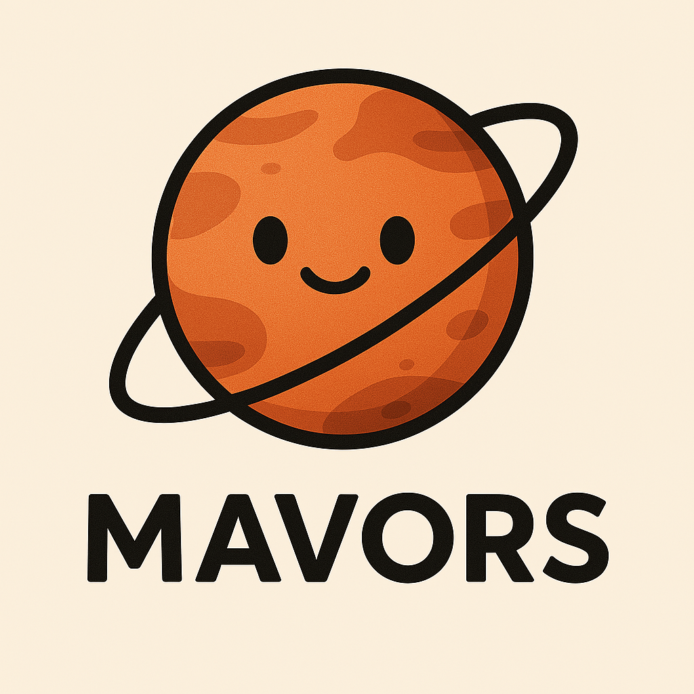

# **Mavors**

## Mavors: Multi-granularity Video Representation for Multimodal Large Language Model

---

**Project Page:**  

**arXiv Paper:**  

## 📢 News
- **[2025/04/15]** Mavors is released! 🎉 We will gradually open source the code and checkpoints. 😁